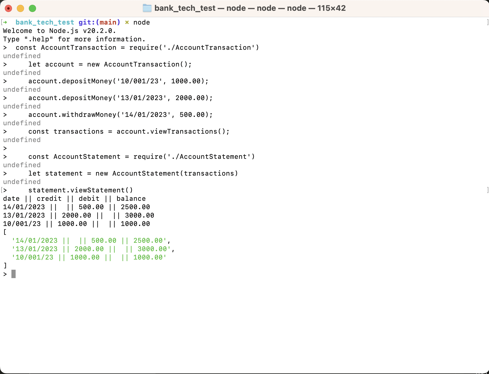
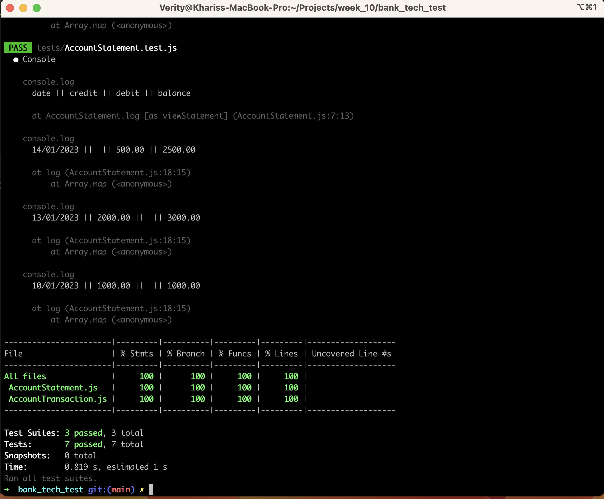

# Bank Tech Test

## Challenge Description
### Acceptance criteria:
Given a client makes a deposit of 1000 on 10-01-2023
And a deposit of 2000 on 13-01-2023
And a withdrawal of 500 on 14-01-2023
When she prints her bank statement
Then she would see

    ;date || credit || debit || balance
    ;14/01/2023 || || 500.00 || 2500.00
    ;13/01/2023 || 2000.00 || || 3000.00
    ;10/01/2023 || 1000.00 || || 1000.00

### Approach
I started by creating a diagram to decide on the classes needed to create this programme. I then went on to writing the tests for these, starting with the AccountTransaction Class, then writing the code to pass these tests and then doing the same for the AccountStatement Class.

## To run programme using node 
1. Clone project into your local machine
2. Open terminal and go into the directory bank_tech_test

     ```
    ; cd bank_tech_test

     ```
3. Install dependencies by running npm install

     ```
    ; npm install

     ```
4. Run programme useing node

     ```
    ;node

    ;const AccountTransaction = require('./AccountTransaction')
    ;let account = new AccountTransaction();
    ;account.depositMoney('10/001/23', 1000.00);
    ;account.depositMoney('13/01/2023', 2000.00);
    ;account.withdrawMoney('14/01/2023', 500.00);
    ;const transactions = account.viewTransactions();

    ;const AccountStatement = require('./AccountStatement')
    ;let statement = new AccountStatement(transactions)
    ;statement.viewStatement()

     ```

## Diagram


## Screenshot of Project Running



## Screenshot of Passing Tests




