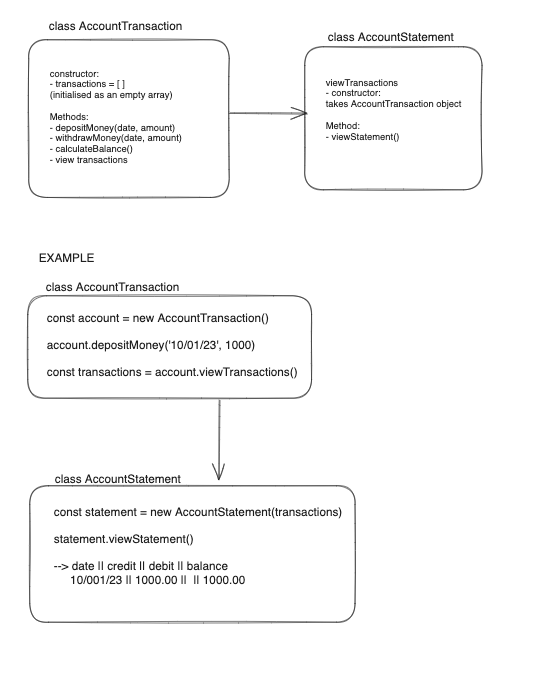

# Bank Tech Test

Create a programme that displays a bank account statment with given information, which includes date, credit, debit and balance.

## Challenge Description
Requirements
You should be able to interact with your code via a REPL like IRB or Node. (You don't need to implement a command line interface that takes input from STDIN.)
Deposits, withdrawal.
Account statement (date, amount, balance) printing.
Data can be kept in memory (it doesn't need to be stored to a database or anything).
Acceptance criteria
Given a client makes a deposit of 1000 on 10-01-2023
And a deposit of 2000 on 13-01-2023
And a withdrawal of 500 on 14-01-2023
When she prints her bank statement
Then she would see

date || credit || debit || balance
14/01/2023 || || 500.00 || 2500.00
13/01/2023 || 2000.00 || || 3000.00
10/01/2023 || 1000.00 || || 1000.00

## To run programme using node
- open terminal and go into the directory bank_tech_test 
- input into terminal:
    node

    const AccountTransaction = require('./AccountTransaction')
    let account = new AccountTransaction();
    account.depositMoney('10/001/23', 1000.00);
    account.depositMoney('13/01/2023', 2000.00);
    account.withdrawMoney('14/01/2023', 500.00);
    const transactions = account.viewTransactions();

    const AccountStatement = require('./AccountStatement')
    let statement = new AccountStatement(transactions)
    statement.viewStatement()

## Diagram

